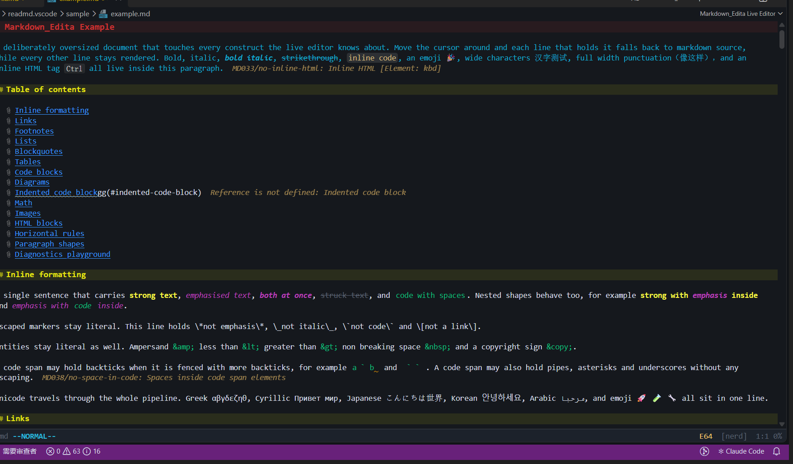
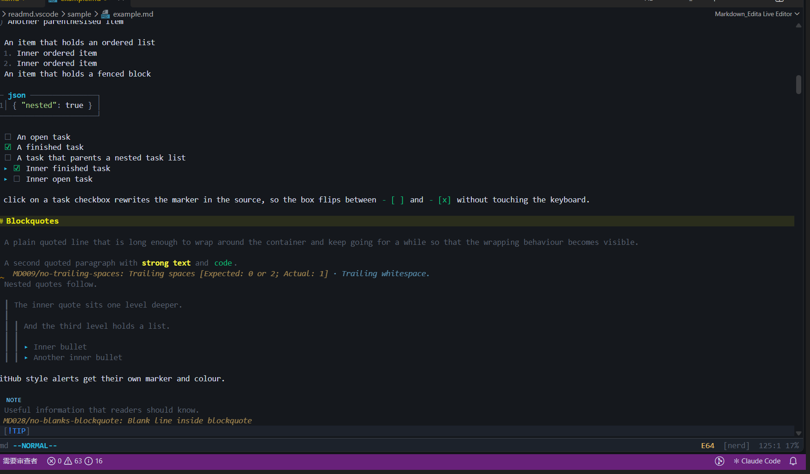
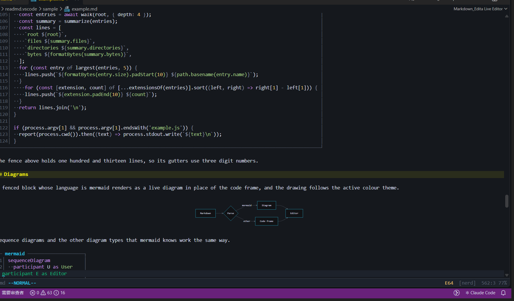
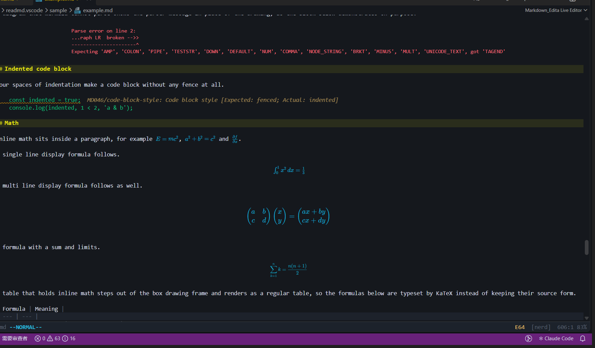
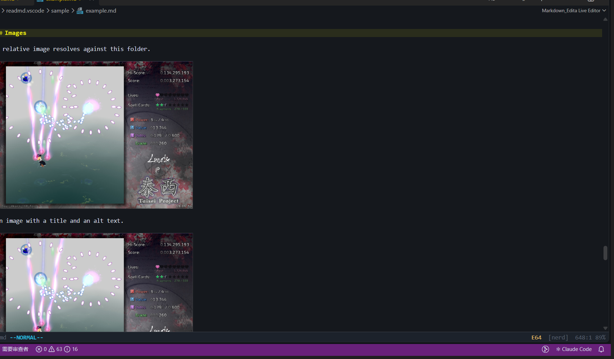

# Markdown_Edita

**在一个窗格里编辑与预览 Markdown,光标所在的那一行永远显示源码,其余内容按照渲染结果显示。**



目录、行内强调、代码跨度与 Unicode 文本都按渲染结果显示,光标所在的那一行则显示 `#` 开头的源码。



任务框可以直接点击方框改写源码,引用与五种 GitHub 提示块各有自己的标记与颜色。



围栏代码块保留行号与语法着色,mermaid 围栏就地渲染成图表。



行内公式与块级公式由 KaTeX 渲染,矩阵与求和符号都按排版规则排布。



相对路径图像解析到文档所在的目录,并按窗格宽度缩放显示。

## 功能

| 功能 | 说明 |
| --- | --- |
| 单窗格实时渲染 | 行内语法在光标离开该行之后显示为结果,光标回到该行时恢复为源码 |
| 块级部件 | 表格、围栏代码块、HTML 块、数学块、Mermaid 图与水平线会整段渲染 |
| 代码高亮 | 由 Shiki 提供,内建 117 种语法与 5 套调色板 |
| 数学公式 | 行内公式与块级公式由 KaTeX 渲染 |
| 图像 | 相对路径图像解析到文档所在的目录 |
| 模态按键 | 内建 normal、insert、visual 与 command 模式,支持 j k 等动作 |
| 语言服务 | 诊断、补全、悬停、跳转定义、链接、符号与折叠由独立语言服务器提供 |
| 字形风格 | nerd 与 ascii 两套符号,覆盖项目符号、任务框、引用与折叠标记 |

## 快速开始

安装依赖并构建扩展。

```bash
npm install
npm run build
```

打包并安装到本机 VS Code。

```bash
npx @vscode/vsce package
code --install-extension markdown-edita-0.1.0.vsix
```

打开任意 Markdown 文件,扩展会以 Markdown_Edita Live Editor 接管它,你也可以执行 Markdown_Edita: Open with Markdown_Edita Live Editor 手动打开。

> [!NOTE]
> 示例文档位于 sample/example.md,它覆盖了渲染器的全部特性,上面的截图就取自这个文件。

## 命令

| 命令 | 作用 |
| --- | --- |
| Markdown_Edita: Open with Text Editor | 切换回 VS Code 自带的文本编辑器 |
| Markdown_Edita: Open with Markdown_Edita Live Editor | 用实时编辑器打开当前 Markdown 文件 |
| Markdown_Edita: Toggle Preview Mode | 切换预览模式 |
| Markdown_Edita: Toggle Inline Rendering | 开关行内渲染 |
| Markdown_Edita: Toggle Block Widgets | 开关块级部件 |
| Markdown_Edita: Pick Color Palette | 选择配色 |
| Markdown_Edita: Pick Glyph Style | 选择字形风格 |
| Markdown_Edita: Toggle Glyph Style | 在 nerd 与 ascii 之间切换 |
| Markdown_Edita: Show Editor Status | 显示编辑器状态 |

## 配置

| 配置项 | 默认值 | 说明 |
| --- | --- | --- |
| markdown-edita.livePreview.inline | true | 渲染光标之外的行内语法 |
| markdown-edita.livePreview.blocks | true | 渲染光标之外的表格、代码块与 HTML 块 |
| markdown-edita.livePreview.images | true | 渲染光标之外的图像 |
| markdown-edita.livePreview.previewMode | false | 预览模式,光标移动不再揭示源码 |
| markdown-edita.tui.modalKeys | true | 启用模态按键 |
| markdown-edita.tui.lineNumbers | true | 显示行号 |
| markdown-edita.tui.relativeLineNumbers | false | 显示相对行号 |
| markdown-edita.appearance.theme | tokyo | 配色方案,可选 tokyo、vscode、gruvbox、nord、dracula、solarized、mono |
| markdown-edita.appearance.glyphs | nerd | 字形集合,可选 nerd 与 ascii |
| markdown-edita.lint.enabled | true | 发布 Markdown 诊断 |
| markdown-edita.lint.rules | 见默认值 | 诊断规则及其级别 |

## 开发

```bash
npm run watch      # 监听并增量构建
npm run typecheck  # 类型检查
npm run build      # 一次性构建
```

在 VS Code 里按 F5 会启动扩展开发宿主,里面加载的就是当前工作区。

## 目录结构

| 路径 | 内容 |
| --- | --- |
| src/extension.ts | 扩展入口 |
| src/editor | 自定义编辑器与宿主通信 |
| src/server | Markdown 语言服务器 |
| src/shared | 文档扫描与主题定义 |
| webview | 基于 CodeMirror 6 的编辑界面与实时预览装饰 |
| sample | 示例文档与图片 |
| docs | 文档资源 |

## 致谢

界面建立在 CodeMirror 6、markdown-it、Shiki、KaTeX、Mermaid 与 @replit/codemirror-vim 之上。
