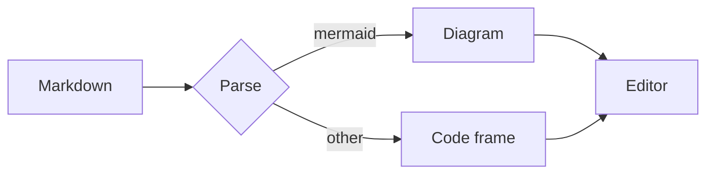
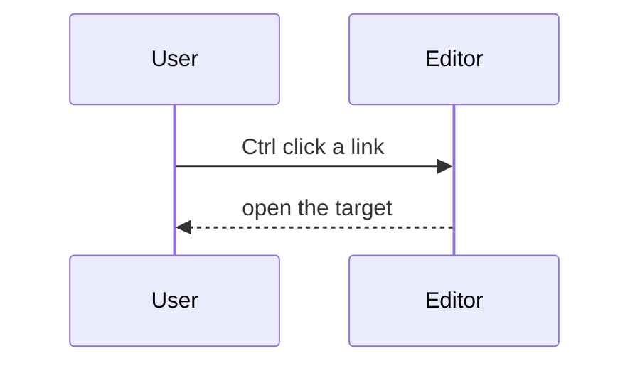

# Markdown_Edita Kitchen Sink

A deliberately oversized document that touches every construct the live editor knows about. Move the cursor around and each line that holds it falls back to markdown source, while every other line stays rendered. Bold, italic, ***bold italic***, ~~strikethrough~~, `inline code`, an emoji 🎉, wide characters 汉字测试, full width punctuation（像这样），and an inline HTML tag <kbd>Ctrl</kbd> all live inside this paragraph.

## Table of contents

- [Inline formatting](#inline-formatting)
- [Links](#links)
- [Footnotes](#footnotes)
- [Lists](#lists)
- [Blockquotes](#blockquotes)
- [Tables](#tables)
- [Code blocks](#code-blocks)
- [Diagrams](#diagrams)
- [Indented code block](#indented-code-block)
- [Math](#math)
- [Images](#images)
- [HTML blocks](#html-blocks)
- [Horizontal rules](#horizontal-rules)
- [Paragraph shapes](#paragraph-shapes)
- [Diagnostics playground](#diagnostics-playground)

## Inline formatting

A single sentence that carries **strong text**, *emphasised text*, ***both at once***, ~~struck text~~, and `code with spaces`. Nested shapes behave too, for example **strong with *emphasis* inside** and *emphasis with `code` inside*.

Escaped markers stay literal. This line holds \*not emphasis\*, \_not italic\_, \`not code\` and \[not a link\].

Entities stay literal as well. Ampersand &amp; less than &lt; greater than &gt; non breaking space &nbsp; and a copyright sign &copy;.

A code span may hold backticks when it is fenced with more backticks, for example ``a ` b `` and `` ` ` ``. A code span may also hold pipes, asterisks and underscores without any escaping.

Unicode travels through the whole pipeline. Greek αβγδεζηθ, Cyrillic Привет мир, Japanese こんにちは世界, Korean 안녕하세요, Arabic مرحبا, and emoji 🚀 🧪 🔧 all sit in one line.

## Links

An [inline link with a title](https://code.visualstudio.com "VS Code home page") and a [relative link to the notes file](notes.md) resolve against the folder that holds this document. A [link to a section](#math) jumps inside the file.

An autolink looks like <https://github.com/microsoft/vscode> and stays clickable without any brackets.

Literal autolinks need no brackets either, so https://code.visualstudio.com, www.example.com and docs@example.com all act as links while trailing punctuation such as this comma, stays outside the target. The scan also skips sequences that sit inside a code span, so `https://code.visualstudio.com` stays literal.

A footnote reference looks like this badge[^badge], and the footnote section below holds the definition.

A reference link looks like [the reference target][markdown-edita-site], and this paragraph also uses a [shortcut reference][notes] form.

An inline link may carry [inline `code` inside its text](notes.md), and a link may hold **strong text** as well.

A linked image wraps two constructs at once, see the image section below.

Broken and dangling forms appear in the diagnostics playground at the end of the document.

[markdown-edita-site]: https://code.visualstudio.com/
[notes]: notes.md

## Footnotes

A footnote reference renders as a small badge[^badge], and a label may carry several characters[^long]. Ctrl clicking the badge jumps to its definition line, and a definition may hold inline markup.

[^badge]: The definition line renders with its marker inside a badge and the body beside it.
[^long]: A definition body may hold **strong text**, `code`, an emoji 🎯 or a bare link such as https://github.com/microsoft/vscode.

A reference without a definition stays literal, so an undefined note[^missing] keeps its brackets and raises no diagnostic.

## Lists

- First bullet
- Second bullet with **strong text**
- Third bullet with a nested list
  - Nested bullet one
  - Nested bullet two
    - Third level bullet
- Fourth bullet with `inline code`

1. First ordered item
2. Second ordered item
3. Third ordered item with two paragraphs

   A continuation paragraph keeps its indentation, and it still belongs to the third item.

4. Fourth ordered item

Mixed shapes follow.

1) Parenthesised ordered item
2) Another parenthesised item

- An item that holds an ordered list
  1. Inner ordered item
  2. Inner ordered item
- An item that holds a fenced block

  ```json
  { "nested": true }
  ```

- [ ] An open task
- [x] A finished task
- [ ] A task that parents a nested task list
  - [x] Inner finished task
  - [ ] Inner open task

A click on a task checkbox rewrites the marker in the source, so the box flips between `- [ ]` and `- [x]` without touching the keyboard.

## Blockquotes

> A plain quoted line that is long enough to wrap around the container and keep going for a while so that the wrapping behaviour becomes visible.
>
> A second quoted paragraph with **strong text** and `code`.
> 
> Nested quotes follow.
>
> > The inner quote sits one level deeper.
> >
> > > And the third level holds a list.
> > >
> > > - Inner bullet
> > > - Another inner bullet

GitHub style alerts get their own marker and colour.

> [!NOTE]
> Useful information that readers should know.

> [!TIP]
> Helpful advice for a task done better.

> [!IMPORTANT]
> Key information that readers need in order to succeed.

> [!WARNING]
> Urgent information that deserves immediate attention.

> [!CAUTION]
> Advice about risks or negative outcomes.

A quote that holds a heading.
>
> ### Quoted heading
>
> A quote that holds a fence.
>
> ```ts
> const quoted: boolean = true;
> const second: number = 2;
> ```
>
> A quote that holds a table.
>
> | inside | quote |
> | --- | --- |
> | yes | indeed |

## Tables

A plain table.

| Language | Typing | Year |
| --- | --- | --- |
| TypeScript | static | 2012 |
| Python | dynamic | 1991 |
| Rust | static | 2010 |

Alignment markers.

| Left | Centre | Right |
| :--- | :---: | ---: |
| alpha | beta | 12 |
| gamma | delta | 345 |
| epsilon | zeta | 6789 |

Tricky cells follow. A cell may hold `code with | pipe`, an escaped \| pipe, a [link](notes.md), **strong**, and an ampersand & together with a less than < sign and a greater than > sign.

| Feature | Markup | Notes |
| --- | --- | --- |
| Escaped pipe | `a \| b` | renders one pipe |
| Entities | `&` `<` `>` | width stays stable |
| Wide text | 汉字宽度测试 | two columns per glyph |
| Emoji | 🚀 🧪 | surrogate pair |
| Empty cell |  | nothing here |

A single column table.

| Only |
| --- |
| one |
| two |

A table whose header row is the only row.

| Solo header |
| --- |

## Code blocks

The language gallery shows every registered fence language. The label sits on the top rule, the line numbers sit between two vertical bars, and the frame closes on the right.

### Language gallery

```javascript
export const twice = (value) => value * 2;
console.log(twice(21));
```

```jsx
const Chip = ({ label }) => <span className="chip">{label}</span>;
```

```typescript
interface Point { x: number; y: number }
const origin: Point = { x: 0, y: 0 };
```

```tsx
export const App = () => <main>Markdown_Edita</main>;
```

```python
def twice(value: int) -> int:
    return value * 2
```

```json
{ "name": "markdown-edita", "private": true, "engines": { "vscode": "^1.90.0" } }
```

```html
<article data-kind="demo">
  <h1>Heading</h1>
</article>
```

```css
.markdown-edita-fence {
  white-space: pre;
  tab-size: 4;
}
```

```xml
<catalog><book id="1"><title>Markdown_Edita</title></book></catalog>
```

```yaml
name: markdown-edita
private: true
engines:
  vscode: ^1.90.0
```

```rust
fn twice(value: i64) -> i64 { value * 2 }
```

```cpp
template <typename T> T twice(T value) { return value * 2; }
```

```java
public final class Twice { static int twice(int value) { return value * 2; } }
```

```go
func twice(value int) int { return value * 2 }
```

```sql
select language, count(*) from fences group by language order by count(*) desc;
```

```csharp
public static int Twice(int value) => value * 2;
```

```kotlin
fun twice(value: Int): Int = value * 2
```

```scala
def twice(value: Int): Int = value * 2
```

```dart
int twice(int value) => value * 2;
```

```lua
local function twice(value) return value * 2 end
```

```r
twice <- function(value) value * 2
```

```ruby
def twice(value) = value * 2
```

```perl
sub twice { my ($value) = @_; return $value * 2; }
```

```swift
func twice(_ value: Int) -> Int { value * 2 }
```

```erlang
twice(Value) -> Value * 2.
```

```haskell
twice :: Int -> Int
twice value = value * 2
```

```pug
p.markdown-edita Hello #{name}
```

```shell
npm run build && code --install-extension markdown-edita-0.1.0.vsix --force
```

```dockerfile
FROM node:22-alpine
WORKDIR /app
CMD ["node", "dist/server.js"]
```

```toml
[package]
name = "markdown-edita"
version = "0.1.0"
```

```diff
- const width = Math.min(96, textWidth);
+ const contentWidth = Math.max(textWidth, labelWidth + 1 - numberWidth);
```

```ini
[markdown-edita]
theme = tokyo
glyphs = nerd
```

```powershell
Get-ChildItem -Recurse -Filter *.md | Select-Object -First 10 FullName
```

### Fence edge cases

An info string may carry extra words after the language, the label keeps the first word only.

```ts title="demo.ts" {1,3}
export const demo = true;
```

A tab inside a fence expands to a tab stop, so the frame still closes.

```ini
[root]
	indented = with a tab
	another = with a tab
[leaf]
	deep = value
```

A line longer than one hundred columns used to push the right border out of the frame. The border now follows the content, and the block scrolls sideways when it has to. The next fence proves it.

```json
{"id":"markdown-edita","displayName":"Markdown_Edita","description":"Markdown language server and a single pane live editing surface with modal keys","keywords":["markdown","live preview","language server","modal","tui"],"categories":["Programming Languages","Other"],"engines":{"vscode":"^1.90.0"}}
```

A fence whose language is unknown falls back to plain text while the label still shows the token.

```typescript-experimental-dialect-xxxx
let unhighlighted = 1;
```

A fence may hold wide characters and emoji.

```text
汉字宽度 测试行
emoji 🚀 行 with tail
```

A fence may hold entities and angle brackets.

```html
<div class="a & b">1 < 2 && 3 > 2</div>
```

A tilde fence works the same way.

~~~text
tilde fenced
~~~

A longer fence nests a shorter one.

````markdown
```ts
const nested = true;
```
````

An empty fence still draws a frame.

```text
```

### Long fence with three digit line numbers

```typescript
import { promises as fs } from 'node:fs';
import path from 'node:path';

export interface Entry {
  name: string;
  size: number;
  directory: boolean;
}

export interface WalkOptions {
  depth: number;
  follow: boolean;
  filter: (name: string) => boolean;
}

const DEFAULTS: WalkOptions = {
  depth: 8,
  follow: false,
  filter: () => true,
};

export async function walk(root: string, options: Partial<WalkOptions> = {}): Promise<Entry[]> {
  const settings = { ...DEFAULTS, ...options };
  const found: Entry[] = [];
  const seen = new Set<string>();

  async function visit(directory: string, depth: number): Promise<void> {
    if (depth > settings.depth) {
      return;
    }
    const real = await fs.realpath(directory);
    if (seen.has(real)) {
      return;
    }
    seen.add(real);
    const names = await fs.readdir(directory);
    for (const name of names.sort()) {
      if (!settings.filter(name)) {
        continue;
      }
      const target = path.join(directory, name);
      const stat = await fs.lstat(target);
      if (stat.isSymbolicLink() && !settings.follow) {
        continue;
      }
      if (stat.isDirectory()) {
        found.push({ name: target, size: 0, directory: true });
        await visit(target, depth + 1);
        continue;
      }
      found.push({ name: target, size: stat.size, directory: false });
    }
  }

  await visit(root, 0);
  return found;
}

export function summarize(entries: Entry[]): { files: number; directories: number; bytes: number } {
  let files = 0;
  let directories = 0;
  let bytes = 0;
  for (const entry of entries) {
    if (entry.directory) {
      directories += 1;
      continue;
    }
    files += 1;
    bytes += entry.size;
  }
  return { files, directories, bytes };
}

export function formatBytes(bytes: number): string {
  const units = ['B', 'KiB', 'MiB', 'GiB', 'TiB'];
  let value = bytes;
  let unit = 0;
  while (value >= 1024 && unit < units.length - 1) {
    value /= 1024;
    unit += 1;
  }
  return `${value.toFixed(unit === 0 ? 0 : 1)} ${units[unit]}`;
}

export function largest(entries: Entry[], count: number): Entry[] {
  return entries
    .filter((entry) => !entry.directory)
    .sort((left, right) => right.size - left.size)
    .slice(0, count);
}

export function extensionsOf(entries: Entry[]): Map<string, number> {
  const counts = new Map<string, number>();
  for (const entry of entries) {
    if (entry.directory) {
      continue;
    }
    const extension = path.extname(entry.name).toLowerCase() || '(none)';
    counts.set(extension, (counts.get(extension) ?? 0) + 1);
  }
  return counts;
}

export async function report(root: string): Promise<string> {
  const entries = await walk(root, { depth: 4 });
  const summary = summarize(entries);
  const lines = [
    `root ${root}`,
    `files ${summary.files}`,
    `directories ${summary.directories}`,
    `bytes ${formatBytes(summary.bytes)}`,
  ];
  for (const entry of largest(entries, 5)) {
    lines.push(`${formatBytes(entry.size).padStart(10)} ${path.basename(entry.name)}`);
  }
    for (const [extension, count] of [...extensionsOf(entries)].sort((left, right) => right[1] - left[1])) {
    lines.push(`${extension.padEnd(10)} ${count}`);
  }
  return lines.join('\n');
}

if (process.argv[1] && process.argv[1].endsWith('kitchen-sink.js')) {
  report(process.cwd()).then((text) => process.stdout.write(`${text}\n`));
}
```

The fence above holds one hundred and thirteen lines, so its gutters use three digit numbers.

## Diagrams

A fenced block whose language is mermaid renders as a live diagram in place of the code frame, and the drawing follows the active colour theme.



Sequence diagrams and the other diagram types that mermaid knows work the same way.



A diagram that mermaid cannot parse shows the parser message in place of the drawing, as the block below demonstrates on purpose.

```mermaid
graph LR
  broken -->>
```

## Indented code block

Four spaces of indentation make a code block without any fence at all.

    const indented = true;
    console.log(indented, 1 < 2, 'a & b');

## Math

Inline math sits inside a paragraph, for example $E = mc^2$, $a^{2} + b^{2} = c^{2}$ and $\frac{\partial f}{\partial x}$.

A single line display formula follows.

$$ \int_{0}^{1} x^{2} \, dx = \frac{1}{3} $$

A multi line display formula follows as well.

$$
\begin{pmatrix} a & b \\ c & d \end{pmatrix}
\begin{pmatrix} x \\ y \end{pmatrix}
= \begin{pmatrix} ax + by \\ cx + dy \end{pmatrix}
$$

A formula with a sum and limits.

$$
\sum_{k=1}^{n} k = \frac{n(n+1)}{2}
$$

A table that holds inline math steps out of the box drawing frame and renders as a regular table, so the formulas below are typeset by KaTeX instead of keeping their source form.

| Formula | Meaning |
| --- | --- |
| $e^{i\pi} + 1 = 0$ | Euler identity |
| $c = \sqrt{a^{2} + b^{2}}$ | Pythagoras |

## Images

A relative image resolves against this folder.


An image with a title and an alt text.

")

A linked image.

[](https://commons.wikimedia.org/wiki/File:Taisei_1.3_Shootem_up_20190425_16-50-29-232.png)

A tiny inline image that needs no file at all.


A missing image is reported by the broken link rule, and the browser falls back to its usual broken image icon.


## HTML blocks

Inline HTML mixes into a paragraph, for example H<sub>2</sub>O, x<sup>2</sup>, <mark>marked text</mark>, <abbr title="Read The Friendly Manual">RTFM</abbr>, and <span style="color: var(--markdown-edita-accent)">a coloured span</span>.

A block level element renders as a widget when the cursor is elsewhere.

<details>
<summary>Click to expand this block</summary>

Block level HTML such as `details`, `summary`, `div` and `table` renders when the cursor is outside, and falls back to source when the cursor is inside.

</details>

<div class="note">

A `div` block with a paragraph inside.

- A list inside HTML
- Another item

</div>

<table>
<tr><th>HTML</th><th>Table</th></tr>
<tr><td>renders</td><td>too</td></tr>
</table>

An HTML comment stays invisible.

<!-- this comment never reaches the screen -->

## Horizontal rules

Three marker styles draw the same rule.

---

***

___

## Paragraph shapes

A very long paragraph follows, and it exists to show how wrapping behaves when the line is far wider than the viewport. The quick brown fox jumps over the lazy dog while the renderer keeps counting columns, mapping decorations, and deciding which block widget replaces which range of source text. Because the cursor line always shows markdown source, a reader can place the caret anywhere and flip that single line between source and rendered form, which is the whole point of a single pane live editing surface.

A line with two trailing spaces ends with a hard break, and the very next line continues on a fresh rendered line.

A line with a backslash at its end also breaks the line,\
and this line follows the break.

An extremely long single line follows without any break at all, and it is here to prove that a paragraph with hundreds of characters still wraps inside the pane instead of forcing a horizontal scrollbar across the editor: Markdown_Edita keeps the live preview decorations anchored to document offsets, so wrapping never desynchronises a mark or a replaced range, and the widget for a block is rebuilt only when its source text or the surrounding settings change.

A paragraph with only a single word follows.

Enigma.

## Diagnostics playground

Every line below is deliberate. The gutter shows one marker per enabled rule, and the status bar counts them.

### Intentional heading problems

##### A level five heading follows a level three heading

##  A heading with extra spacing

# Tight heading without space

## Diagnostics playground

# Second top level heading

## Intentional whitespace problems

A paragraph line with a tab	in the middle of it.

A paragraph line with three trailing spaces.   

Two blank lines follow this paragraph.


### Intentional link problems

A [link to a file that does not exist](no-such-file.md) and a [dangling reference][nowhere].

An [](<>) empty link.

A definition that nobody references follows on the last line.

[orphan]: https://example.com/unused

### Intentional fence problem

```
fenced without a language
```
