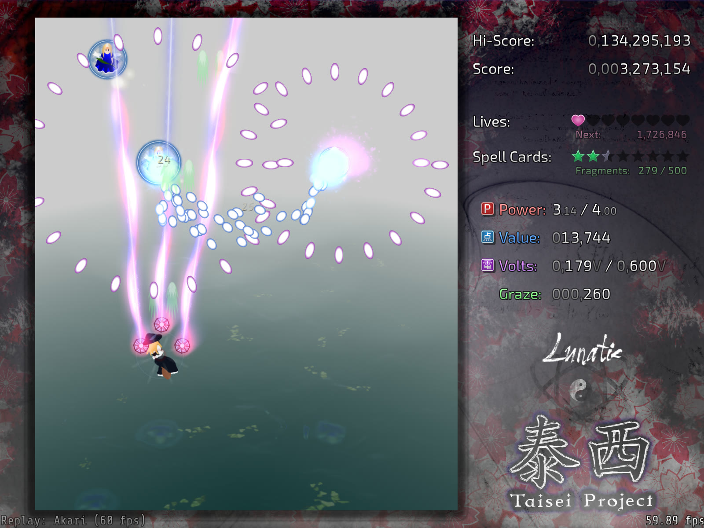

# Markdown_Edita Sample

A short document that exercises the live editing surface. The cursor line always shows its markdown source, and every other line stays rendered.

## Inline

Text with **bold**, *italic*, ~~strikethrough~~, `inline code`, a [relative link](notes.md), an [anchor link](#keys) and an [external link](https://code.visualstudio.com).

## Restricted HTML

<details>
<summary>Click to expand a block level HTML element</summary>

Block level HTML such as `details`, `summary`, `div` and `table` is rendered when the cursor is elsewhere, and shown as source when the cursor is inside.

</details>

Inline HTML such as <kbd>Ctrl</kbd> + <kbd>Shift</kbd>, H<sub>2</sub>O and <mark>marked text</mark> is rendered inside the paragraph.

## Math

Inline math such as $E = mc^2$ sits inside the paragraph, and $a^{2} + b^{2} = c^{2}$ is the Pythagorean identity.

$$
\int_{0}^{1} x^{2} \, dx = \frac{1}{3}
$$

## Blocks

| Feature | State |
| --- | --- |
| Table widget | framed |
| Code fence | highlighted |
| Image | resolved |

1. Ordered item one
2. Ordered item two

> A quoted line keeps its own color, and the quote marker becomes a glyph.

---

```ts
export function twice(value: number): number {
  return value * 2;
}
```

- [ ] open task
- [x] finished task



## Links

The relative link opens [the notes file](notes.md), while [this broken link](missing-notes.md) keeps one diagnostic visible on purpose.

## Keys

Normal mode moves the cursor, insert mode edits the cursor line, and the command line accepts `:w`, `:preview` and `:q`.
